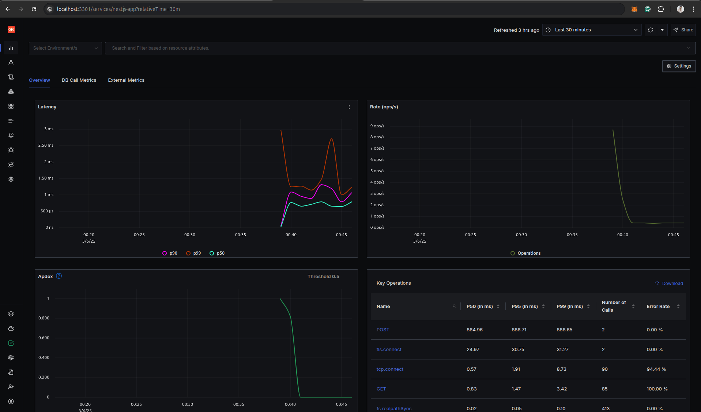

# NestJS OpenTelemetry SDK

[](https://www.npmjs.com/package/nestjs-otel-sdk)
[](LICENSE)
[](https://github.com/praveenrampk/nestjs-otel-sdk/issues)

A pre-configured OpenTelemetry setup for NestJS applications. This package simplifies the process of integrating OpenTelemetry for logging and tracing in a NestJS project, providing an optimized and minimalistic way to set up observability.

## Features

- 🚀 **Minimal Setup**: Quickly integrate OpenTelemetry with NestJS without additional boilerplate.
- 📡 **Logging & Tracing**: Automatically captures logs and traces for your application.
- 📊 **OTLP Exporters**: Supports OTLP HTTP-based exporters for logs and traces.
- 🔧 **Custom Logger Service**: Extends NestJS' built-in logger to send logs to OpenTelemetry.
- 🎯 **Optimized Performance**: Uses batch processing for efficient log and trace exports.

---

## Installation

```sh
npm install nestjs-otel-sdk
```

or

```sh
yarn add nestjs-otel-sdk
```

## Getting Started

### 1. Bootstrap OpenTelemetry and OtelLoggerService

In your main application entry point, initialize OpenTelemetry:

```typescript
import { bootstrapOTEL, OtelLoggerService } from 'nestjs-otel-sdk'; // Ensure this import is at the top
import { NestFactory } from '@nestjs/core';
import { NestExpressApplication } from '@nestjs/platform-express';
import { AppModule } from './app.module';

async function bootstrap() {
  // Initialize OpenTelemetry before anything else
  bootstrapOTEL();

  // Create the NestJS application instance with CORS enabled
  const app = await NestFactory.create<NestExpressApplication>(AppModule, {
    cors: true,
  });

  // Set up OpenTelemetry as the application logger
  app.useLogger(new OtelLoggerService());

  await app.listen(3000);
  console.log('Application is running on http://localhost:3000');
}

bootstrap();
```

This will automatically start collecting logs and traces for your application.

### 2. Environment Configuration

You can override default OpenTelemetry configuration using environment variables:

```sh
OTEL_SERVICE_NAME=my-nestjs-app
OTEL_SERVICE_VERSION=2.0.0
OTEL_TRACE_EXPORTER_URL=http://localhost:4318/v1/traces
OTEL_LOG_EXPORTER_URL=http://localhost:4318/v1/logs
```

### 3. Setting Up OpenTelemetry Collector (Optional)

To collect and process telemetry data, you need to run an OpenTelemetry Collector instance. You can start one using Docker:

```sh
docker run -p 4317:4317 -p 4318:4318 otel/opentelemetry-collector-contrib
```

---

## Setting Up SigNoz for Observability

To visualize logs, traces, and metrics, you can use [SigNoz](https://signoz.io/).

### Docker Standalone Installation

#### Prerequisites
- A Linux or macOS machine (Windows is not officially supported).
- On macOS, install Docker Engine manually before running the install script.
- Ensure at least 4GB of memory is allocated to Docker.
- Open ports 3301, 4317, and 4318 on the machine.

#### Install SigNoz Using the Install Script

```sh
git clone -b main https://github.com/SigNoz/signoz.git && cd signoz/deploy/
./install.sh
```

#### Install SigNoz Using Docker Compose

Ensure Docker Compose is installed before running the following commands:

```sh
git clone -b main https://github.com/SigNoz/signoz.git && cd signoz/deploy/
cd deploy/docker
docker compose up -d --remove-orphans
```

#### Verify the Installation
Run the following command to check if all containers are running:

```sh
docker ps
```

The output should look similar to this:

```
CONTAINER ID   IMAGE                                        STATUS                    PORTS                                    NAMES
e484b23a8f61   signoz/frontend:0.69.0                       Up 45 minutes             0.0.0.0:3301->3301/tcp                   signoz-frontend
afd3e434e853   signoz/signoz-otel-collector:0.111.24        Up 45 minutes             0.0.0.0:4317-4318->4317-4318/tcp         signoz-otel-collector
```

#### Access the SigNoz Dashboard

Once the containers are running, access the SigNoz dashboard at:

- **Local machine:** [http://localhost:3301/](http://localhost:3301/)
- **Remote machine:** Replace `<IP-ADDRESS>` with the machine's IP: `http://<IP-ADDRESS>:3301/`

By default, retention period is set to 7 days for logs and traces, and 30 days for metrics. You can modify this in the **General tab** under **Settings** in the SigNoz UI.


---

## API Reference

### `bootstrapOTEL()`
Bootstraps OpenTelemetry with log and trace exporters.

### `OtelLoggerService`
A custom logger extending `ConsoleLogger` to send logs to OpenTelemetry.

```typescript
const logger = new OtelLoggerService();
logger.log('This is a log message');
logger.error('An error occurred');
```

---

## Contributing

Contributions are welcome! Feel free to submit a pull request or open an issue.

1. Clone the repository:
   
   ```sh
   git clone https://github.com/praveenrampk/nestjs-otel-sdk.git
   ```

2. Install dependencies:
   
   ```sh
   npm install
   ```

3. Run tests:
   
   ```sh
   npm test
   ```

---

## License

This project is licensed under the MIT License - see the [LICENSE](LICENSE) file for details.

---
## 📞 Contact
For queries or suggestions, feel free to reach out:

- **GitHub:** [@praveenrampk](https://github.com/praveenrampk)
- **Twitter/X:** [@praveenrampk](https://twitter.com/praveenrampk)
- **Portfolio:** [praveenram.dev](https://praveenram.netlify.app/)
- **Email:** praveenrampk@gmail.com

For issues and feature requests, visit the [GitHub Issues](https://github.com/praveenrampk/nestjs-otel-sdk/issues) page.
---